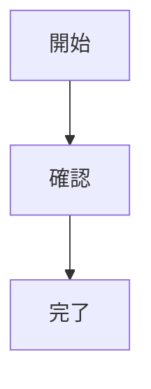

# Japanese Repo Writing

## 基本方針

リポジトリ作業で人が読む説明文は、`AGENTS.md` の有無や内容に依存せず日本語で書く。コード、識別子、API 名、コマンド、ログ、エラー、外部仕様名は英語または原文を維持する。ユーザーが明示的に別言語を指定した場合は、その指定を優先する。

## 日本語で書く対象

- ユーザーへの進捗報告と最終報告
- PR タイトル、PR 説明、issue、review comment
- commit message
- Markdown ドキュメント、設計メモ、README、仕様書、Runbook、提案書、ナレッジ記事

英語テンプレートを使う場合でも、見出しと本文は日本語に直す。

## Git / PR 作業前チェック

commit、push、PR 作成、PR 更新の直前に確認する。

1. commit message が日本語で、人向け説明として自然か。
2. PR タイトルが日本語か。
3. PR 説明の見出しと本文が日本語か。
4. 変更対象外の未コミット差分を混ぜていないか。

推奨表現:

- PR タイトル例: `Agent の NuGet 設定が restore に混入する問題を修正`
- PR 説明見出し例: `## 概要`、`## 確認内容`、`## 補足`
- commit message 例: `Agent の NuGet 設定を restore 対象から除外`

## Markdown ドキュメント作成手順

1. ドキュメントの目的を確認する。
   - 内容、読者、目的、範囲、期待する成果物が不明な場合は、短く質問する。
   - 質問は長いアンケートにせず、重要度の高い 3 から 6 問に絞る。
   - ユーザーが十分な材料を提供している場合は、不要な確認を挟まずに作成へ進む。

2. 材料を整理する。
   - 読者、目的、主張、制約、読者に求める判断や行動を特定する。
   - 事実、仮定、未確認事項、手順、例、背景情報を分ける。
   - 重要な情報が不足している場合は、勝手に補完せず、未確認事項として扱う。

3. 内容に合わせて構成を最適化する。
   - 固定テンプレートに当てはめず、文書の目的に合う順序を選ぶ。
   - 読者の判断や行動に必要な情報を早い位置に置く。
   - 見出しは「概要」「詳細」だけにせず、内容が具体的に伝わる名前にする。
   - 長く混ざった節は、話題や読者のタスクごとに分割する。

4. 日本語 Markdown で本文を書く。
   - 明確で自然な日本語にする。
   - 見出し、短い段落、箇条書きを使い、読みやすくする。
   - 表は、比較、一覧、項目定義、マトリクスなど、構造化した方が読みやすい場合に使う。
   - 理解や行動に役立たない装飾は避ける。

5. 必要な図を Mermaid で描く。
   - フロー、構成、シーケンス、状態、依存関係、判断分岐、関係性の説明に Mermaid を使う。
   - 図は、それを説明する節の近くに置く。
   - 図中のラベルは短く、読みやすい日本語にする。
   - Azure DevOps Wiki では通常の `mermaid` コードフェンスではなく、`::: mermaid` と `:::` で囲む。

6. 本文と補足を分離する。
   - 補足説明を本文の主張や手順の途中に混ぜない。
   - 補足は短いコールアウトとして明示する。

```markdown
> [!INFO]
> 背景、理由、定義、注意点、関連情報などを書く。

> [!TIP]
> 実務上のコツ、近道、確認の観点などを書く。
```

7. 最後に確認する。
   - 読者、目的、次の行動が明確か。
   - 構成が内容の流れに合っているか。
   - Mermaid 図が出力先に合う形式で書かれているか。
   - Info/Tips が本文から分離されているか。
   - 根拠のない重要な仮定を追加していないか。

## 構成の選び方

目的に応じて構成を選ぶ。これらは出発点として扱い、ユーザーの内容に合わない場合は自然な構成へ調整する。

- ガイド、チュートリアル: 概要 -> 前提 -> 手順 -> 確認方法 -> 補足
- 設計書: 背景 -> 目的 -> 要件 -> 方針 -> 構成図 -> 詳細 -> リスク -> 未決事項
- README: 概要 -> セットアップ -> 使い方 -> 設定 -> 開発 -> トラブルシュート
- Runbook: 目的 -> 判断基準 -> 手順 -> ロールバック -> 確認 -> 連絡先
- 提案書: 課題 -> 提案 -> 効果 -> 実施計画 -> コスト/リスク -> 判断事項
- ナレッジ記事: 要点 -> 背景 -> 詳細 -> 例 -> 関連情報

## 出力ルール

- ユーザーが別途説明を求めていない場合は、完成した Markdown 本文を出力する。
- 内容が不足している場合は、不足が作成を妨げるなら質問し、妨げないなら短い `未確認事項` 節を追加する。
- 通常の Markdown では Mermaid のコードフェンスを使う。

````markdown

````

- Azure DevOps Wiki では次の形式を使う。

```markdown
::: mermaid
graph TD
  A[開始] --> B[確認]
  B --> C[完了]
:::
```
